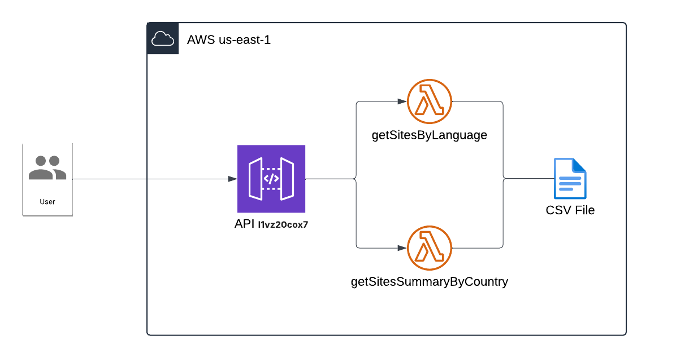

# WHC-Sites

## Overview



This infrastructure provides an API to interact with World Heritage site data stored in a CSV file. It uses AWS services to deliver a scalable and serverless solution for retrieving site information by language or by country summary.

### Architecture Components

1.-  **API Gateway**: Serves as the entry point for the API. It routes user requests to the appropriate Lambda function.

2.-  **Lamnbda Functions**
  * *getSitesByLanguage*: Retrieves site names and descriptions in the specified language. (en, es, fr).
  * *getSitesSummaryByCountry*: Returns a summary of World Heritage sites for a specified country, including counts by site type (Cultural, Natural, Mixed).

## API Endpoints

### getSitesByLanguage
This endpoint retrieves sites by language.

- **URL**: `/api/countries`
- **Method**: `GET`
- **Description**: Retrieves a list of sites filtered by the specified language.

#### Example Request
```bash
curl -X GET "https://api-gateway-url/stage/api/countries?language=es"
````

Example Response
```json
[
    {
        "id": "208",
        "name": "Paisaje cultural y vestigios arqueológicos del Valle de Bamiyán",
        "description": "<p>Este sitio es un exponente de las creaciones artísticas y religiosas características de la antigua Bactriana entre el siglo I y el XIII, en las que confluyeron distintas influencias culturales que desembocaron en la afirmación de la escuela de arte búdico del Gandhara. El sitio comprende varios conjuntos monásticos y santuarios budistas, así como edificios fortificados de la época islámica. El valle fue escenario de la trágica destrucción de las dos monumentales estatuas de Buda en pie, perpetrada por los talibanes en marzo de 2001, que causó una honda conmoción en el mundo entero.</p>",
        "country": "Afghanistan",
        "region": "Asia and the Pacific"
    }
]
```

### getSitesSummaryByCountry
This endpoint retrieves sites by language.

- **URL**: `/api/countries/{country_name}/summary`
- **Method**: `GET`
- **Description**: Retrieves a summary of sites for the specified country.

#### Example Request
```bash
curl -X GET "https://api-gateway-url/stage/api/countries/USA/summary""
````

Example Response
```json
{
  "country": "USA",
  "total_sites": 10,
  "sites": [
    {
      "id": "1",
      "name": "Site Name",
      "description": "Site Description"
    },
    ...
  ]
}
```

This project contains source code and supporting files for a serverless application that you can deploy with the AWS Serverless Application Model (AWS SAM) command line interface (CLI). It includes the following files and folders:

- `src` - Code for the application's Lambda function.
- `events` - Invocation events that you can use to invoke the function.
- `__tests__` - Unit tests for the application code. 
- `template.yaml` - A template that defines the application's AWS resources.

## Deploy the API
To use the AWS SAM CLI, you need the following tools:

* AWS SAM CLI - [Install the AWS SAM CLI](https://docs.aws.amazon.com/serverless-application-model/latest/developerguide/serverless-sam-cli-install.html).
* Node.js - [Install Node.js 20](https://nodejs.org/en/), including the npm package management tool.
* Docker - [Install Docker community edition](https://hub.docker.com/search/?type=edition&offering=community).

To build and deploy your application for the first time, run the following in your shell:

```bash
sam build
sam deploy --guided
```

The first command will build the source of your application. The second command will package and deploy your application to AWS, with a series of prompts:

* **Stack Name**: The name of the stack to deploy to CloudFormation. This should be unique to your account and region, and a good starting point would be something matching your project name.
* **AWS Region**: The AWS region you want to deploy your app to.
* **Confirm changes before deploy**: If set to yes, any change sets will be shown to you before execution for manual review. If set to no, the AWS SAM CLI will automatically deploy application changes.
* **Allow SAM CLI IAM role creation**: Many AWS SAM templates, including this example, create AWS IAM roles required for the AWS Lambda function(s) included to access AWS services. By default, these are scoped down to minimum required permissions. To deploy an AWS CloudFormation stack which creates or modifies IAM roles, the `CAPABILITY_IAM` value for `capabilities` must be provided. If permission isn't provided through this prompt, to deploy this example you must explicitly pass `--capabilities CAPABILITY_IAM` to the `sam deploy` command.
* **Save arguments to samconfig.toml**: If set to yes, your choices will be saved to a configuration file inside the project, so that in the future you can just re-run `sam deploy` without parameters to deploy changes to your application.

The API Gateway endpoint API will be displayed in the outputs when the deployment is complete.